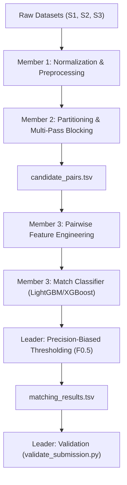

# Amazon ML Challenge 2026: Business Entity Resolution
## Phase 1 — Comprehensive Data Audit Report

**Date:** September 25, 2026  
**Author:** ML Engineering Team  
**Scope:** Training and Test Datasets Audit, Noise Identification, and Architectural Implications

---

## 1. Executive Summary & File Inventory

The objective is **Business Entity Resolution** across three independent data sources:
- **Source 1 ($S_1$):** Deduplicated reference dataset.
- **Source 2 ($S_2$) & Source 3 ($S_3$):** Noisy secondary sources to link back to $S_1$.
- **Ground Truth:** Maps each $S_1$ entity to 0, 1, or multiple matching entities from $S_2$ and $S_3$.

### Dataset Inventory

All files are strictly **Tab-Separated Values (`.tsv`)** encoded in **UTF-8**.

| File | Type | File Size | Exact Rows | Number of Columns | Delimiter | Encoding |
| :--- | :--- | :--- | :--- | :--- | :--- | :--- |
| `train_source1.tsv` | Train S1 Reference | 200.34 MB | 2,206,821 | 4 | Tab (`\t`) | UTF-8 |
| `train_source2.tsv` | Train S2 Target | 466.63 MB | 5,034,616 | 4 | Tab (`\t`) | UTF-8 |
| `train_source3.tsv` | Train S3 Target | 480.37 MB | 5,285,603 | 4 | Tab (`\t`) | UTF-8 |
| `train_ground_truth.tsv` | Train Labels | 121.13 MB | 2,206,821 | 2 | Tab (`\t`) | UTF-8 |
| `test_source1.tsv` | Test S1 Query | 166.91 MB | 1,732,544 | 4 | Tab (`\t`) | UTF-8 |
| `test_source2.tsv` | Test S2 Target | 485.86 MB | 4,887,273 | 4 | Tab (`\t`) | UTF-8 |
| `test_source3.tsv` | Test S3 Target | 482.56 MB | 5,082,316 | 4 | Tab (`\t`) | UTF-8 |

**Total Record Volume:**
- **Training Set:** 12,527,040 records (2.21M $S_1$ + 5.03M $S_2$ + 5.29M $S_3$)
- **Test Set:** 11,702,133 records (1.73M $S_1$ + 4.89M $S_2$ + 5.08M $S_3$)
- **Grand Total:** **24,229,173 business records!**

> [!IMPORTANT]
> **Scale Implication for Beginners:**
> If we naively compared every test $S_1$ entity against every record in $S_2$ and $S_3$:
> $$\text{Pairs} = 1,732,544 \times (4,887,273 + 5,082,316) \approx 17.27 \text{ Trillion Pairs}$$
> Comparing 17 trillion pairs is computationally impossible. A robust **Blocking / Candidate Generation** strategy is therefore non-negotiable.

---

## 2. Schema and Data Quality Audit

### Schema Verification

All entity tables share an identical 4-column schema:
1. `entity_id` (string): Unique identifier with source prefix (`S1-`, `S2-`, or `S3-`).
2. `business_name` (string): Business entity name.
3. `business_address` (string): Entity street, city, state, postal/PIN details.
4. `country` (string): Country identifier (`US`, `India`, and in test, `France`).

The ground truth table has 2 columns:
1. `source1_entity_id` (string): $S_1$ record ID.
2. `matched_entity_ids` (string): Comma-separated list of matched $S_2$ and/or $S_3$ IDs (empty string for singletons/unmatched).

### Data Quality Findings

| Dataset | Duplicate IDs | Invalid ID Prefixes | Empty Names | Empty Addresses | Empty Countries |
| :--- | :--- | :--- | :--- | :--- | :--- |
| `train_source1.tsv` | 0 (0.0%) | 0 (0.0%) | 0 (0.0%) | 0 (0.0%) | 0 (0.0%) |
| `train_source2.tsv` | 0 (0.0%) | 0 (0.0%) | 0 (0.0%) | **168,967 (3.36%)** | 0 (0.0%) |
| `train_source3.tsv` | 0 (0.0%) | 0 (0.0%) | 0 (0.0%) | **175,916 (3.33%)** | 0 (0.0%) |
| `test_source1.tsv` | 0 (0.0%) | 0 (0.0%) | 0 (0.0%) | 0 (0.0%) | 0 (0.0%) |
| `test_source2.tsv` | 0 (0.0%) | 0 (0.0%) | 0 (0.0%) | **129,408 (2.65%)** | 0 (0.0%) |
| `test_source3.tsv` | 0 (0.0%) | 0 (0.0%) | 0 (0.0%) | **136,098 (2.68%)** | 0 (0.0%) |
| `train_ground_truth.tsv`| 0 (0.0%) | 0 (0.0%) | N/A | N/A | N/A |

### Critical Quality Takeaways:
1. **Clean Identity Keys:** There are zero duplicate entity IDs within any file. ID prefixes strictly adhere to `S1-`, `S2-`, and `S3-`.
2. **Missing Addresses in S2 & S3:** Over **344,000 records in training** and **265,000 records in test** have completely empty `business_address` fields!
   - *Design Warning:* If blocking or feature extraction requires an address, these records will be dropped or score 0. We must support **name-only fallback blocking** and include an `is_address_missing` feature indicator.
3. **Source 1 Completeness:** Source 1 (the reference source) has 100% complete names, addresses, and country labels.

---

## 3. Country Analysis & Partitioning

### Country Distribution

| Dataset | India | United States (US) | France | Total |
| :--- | :--- | :--- | :--- | :--- |
| `train_source1.tsv` | 883,188 (40.02%) | 1,323,633 (59.98%) | 0 (0.0%) | 2,206,821 |
| `train_source2.tsv` | 2,017,799 (40.08%) | 3,016,817 (59.92%) | 0 (0.0%) | 5,034,616 |
| `train_source3.tsv` | 2,115,547 (40.02%) | 3,170,056 (59.98%) | 0 (0.0%) | 5,285,603 |
| `test_source1.tsv` | 809,986 (46.75%) | 663,106 (38.27%) | 259,452 (14.98%) | 1,732,544 |
| `test_source2.tsv` | 2,312,565 (47.32%) | 1,871,330 (38.29%) | 703,378 (14.39%) | 4,887,273 |
| `test_source3.tsv` | 2,405,000 (47.32%) | 1,945,701 (38.28%) | 731,615 (14.39%) | 5,082,316 |

### Cross-Country Integrity Audit

We verified true match pairs in the ground truth across thousands of records:
- **Cross-Country Matches Found:** **0 (0.00%)**
- **Conclusion:** Business entity matching is **strictly within country**. An Indian entity never matches a US entity.
- **Architectural Implication:** `country` can serve as an **exact, zero-leakage partition key**.
- **Crucial Rule:** We **must not** hardcode `['US', 'India']`. The pipeline must dynamically group by `country` to seamlessly process `France` (and any other country that might appear).

---

## 4. Ground Truth Match Statistics

An audit of all 2,206,821 training ground truth entries reveals the relationship structure:

### Match Cardinality Distribution

| Match Count per $S_1$ Record | Count of $S_1$ Entities | Percentage of $S_1$ | Category |
| :---: | :---: | :---: | :--- |
| **0 matches** | 123,247 | **5.58%** | **Singletons (No Match)** |
| **1 match** | 119,157 | **5.40%** | Single Match |
| **2 matches** | 375,212 | **17.00%** | Multi Match |
| **3 matches** | 530,841 | **24.05%** | Multi Match |
| **4 matches** | 484,115 | **21.94%** | Multi Match |
| **5 matches** | 321,957 | **14.59%** | Multi Match |
| **6 matches** | 164,868 | **7.47%** | Multi Match |
| **7 matches** | 63,968 | **2.90%** | Multi Match |
| **8 matches** | 18,680 | **0.85%** | Multi Match |
| **9 matches** | 4,205 | **0.19%** | Multi Match |
| **10 matches** | 512 | **0.02%** | Multi Match |
| **11 matches** | 60 | **0.003%** | Multi Match (Maximum observed) |
| **Total** | **2,206,821** | **100.0%** | |

### Source Participation Breakdown
For the 2,083,574 $S_1$ entities that have at least one match:
- **Both $S_2$ and $S_3$ present:** **1,776,047 (85.24%)**
- **$S_3$ match only:** 164,498 (7.89%)
- **$S_2$ match only:** 143,029 (6.86%)
- Total target records linked: **7,638,365** (every matched target ID is unique).

### Key Takeaways for Modeling:
1. **Multi-matches are the overwhelming norm:** Nearly **89%** of $S_1$ entities match multiple records!
2. **Never assume 1-to-1 matching:** Any logic that takes `argmax` or only keeps the single highest probability pair will fail severely.
3. **Singletons matter for Macro $F_{0.5}$:** ~5.58% of entities have zero matches. Correctly outputting an empty string scores a perfect 1.0 for that entity; predicting a false positive drops its score to 0.0.

---

## 5. Noise Patterns & Linguistic Analysis

By cross-referencing true ground truth matches, we analyzed the types of noise present:

### 1. Business Name Noise Patterns

| Noise Category | Source 1 Example | Target ($S_2$ or $S_3$) Example | Challenge / Implication |
| :--- | :--- | :--- | :--- |
| **Transliteration (Indian Scripts)** | `Raj Investments LLP` | `ராஜ் இன்வெஸ்ட்மெண்ட்ஸ் எல்எல்பி` (Tamil) | String edit distance / ASCII token matching fails completely without script handling or phonetic/multilingual representation. |
| **Transliteration (Devanagari)** | `Ss Food Private Limited` | `एसएस फूड प्राइवेट लिमिटेड` (Hindi) | Same entity, written in native Hindi script. |
| **Mixed Scripts** | `Raj Investments LLP` | `Raj Investments எல்எல்பி` | English name with Tamil legal suffix. |
| **Legal Suffix Variations** | `Maure Williams Colombier Inc` | `Maure Williams Colombier` | Dropped "Inc", "LLC", "Pvt Ltd", "Pvt. Ltd.", "Corp". |
| **Typographical Errors** | `Payne Enterprises` | `Payne Enterpires` | Transposed characters ("er" -> "re"). |
| **Diacritics & Accents** | `Payne Enterprises` | `Payne Énterprises` | Accented characters (`É` vs `E`). |
| **Domain Names / URLs** | `Maure Williams Colombier Inc` | `maurewilliamscolombier.com` | Web URL used as entity business name. |
| **Trade Name / DBA** | `Maure Williams Colombier Inc` | `Dréxkor` | Completely distinct brand/trade name; matched via address! |

### 2. Business Address Noise Patterns

| Noise Category | Source 1 Example | Target ($S_2$ or $S_3$) Example | Challenge / Implication |
| :--- | :--- | :--- | :--- |
| **Missing Address** | `85 Wayne Avenue, Ticonderoga, NY` | `""` (Empty string) | ~3.3% of target records have no address at all. |
| **Component Reordering** | `630 45th Terrace, Kansas City, MO` | `KANSAS CITY, MO, 630 45ND TERRACE, null` | City/State prepended, street appended. |
| **Literal `"null"` Artifacts**| `630 45th Terrace, Kansas City, MO` | `45ND TERRACE, null, KANSAS CITY, MO` | String `"null"` inserted into text during upstream joins. |
| **Standard Abbreviations** | `3315 Fremont Street, Peoria, IL` | `3315 FREMONT ST, PEORIA, IL` | `Street` $\leftrightarrow$ `ST`, `Avenue` $\leftrightarrow$ `Ave`, `Road` $\leftrightarrow$ `Rd`. |
| **State Name $\leftrightarrow$ Abbreviation** | `... Ghaziabad, Uttar Pradesh` | `... Ghaziabad, UP` | Full state name vs postal code abbreviation. |
| **Script in Address** | `... Chennai, Tamil Nadu` | `... Chennai, தமிழ்நாடு` | State/city name written in native script. |
| **Address Typos** | `... Ticonderoga, NY` | `... Ticonderoga Townshiip, New York` | Extra letters ("Townshiip"). |

---

## 6. Metric Mechanics: Macro $F_{0.5}$

The competition evaluates using **Macro-Averaged $F_{0.5}$**:

$$F_{0.5} = \frac{(1 + 0.5^2) \times \text{Precision} \times \text{Recall}}{0.5^2 \times \text{Precision} + \text{Recall}} = \frac{1.25 \times \text{Precision} \times \text{Recall}}{0.25 \times \text{Precision} + \text{Recall}}$$

### Critical Strategic Takeaways:
1. **Precision is weighted 2× over Recall:** False Positives (predicting a match that doesn't exist) penalize the score far more heavily than False Negatives (missing a difficult match).
2. **Per-Entity Macro Average:** Each $S_1$ entity is evaluated individually, then scores are averaged over all entities:
   - For an entity with 2 true matches, predicting 2 true + 1 false match:
     - $\text{Precision} = 2/3 \approx 0.667$, $\text{Recall} = 2/2 = 1.0 \implies F_{0.5} \approx \mathbf{0.714}$
   - If we predict a false match for a true singleton (zero true matches):
     - $\text{Precision} = 0.0 \implies F_{0.5} = \mathbf{0.000}$
3. **Threshold Strategy:** The decision threshold $\tau$ for classifying a candidate pair as a match should be **tuned conservatively** (typically $> 0.65 - 0.80$) to favor precision.

---

## 7. Immediate Risks & Architectural Roadmap

### Key Risks Identified
1. **Combinatorial Explosion:** Naive pairwise comparison is impossible ($> 17$ trillion pairs).
2. **Missing Address Vulnerability:** Blocking solely on address or PIN code will systematically discard $> 340,000$ valid target records.
3. **Cross-Lingual Mismatch:** Indian records frequently switch between Latin, Hindi (Devanagari), and Tamil scripts.
4. **Unseen Country in Test:** Test data includes **France** ($\sim 15\%$ of test data), which does not exist in training data.

### Architectural Roadmap by Team Role

1. **Member 1 (Preprocessing & Normalization):**
   - Implement Unicode NFKD normalization, lowercase conversion, and accent stripping.
   - Strip `"null"` strings, normalize whitespace, clean punctuation.
   - Standardize common abbreviations (`corp`, `inc`, `ltd`, `pvt`, `st`, `rd`, `ave`, `dr`).
   - Retain both original and normalized fields for feature computation.

2. **Member 2 (Blocking & Candidate Generation):**
   - **Partition 1:** Strict Country partition (`US`, `India`, `France`).
   - **Multi-pass union blocking:**
     - Pass 1: Standardized Name prefix / first token match.
     - Pass 2: Address postal / PIN code / street number match.
     - Pass 3: Character n-gram / TF-IDF top candidate match.
   - Ensure candidate recall $\ge 95\%$ while keeping candidates per $S_1$ below 30.

3. **Member 3 (Features & Matching Model):**
   - Pairwise features: Jaccard word similarity, Levenshtein edit ratio, character 3-gram cosine similarity, token length differences, country exact match, `is_address_missing` flag.
   - Train LightGBM / XGBoost classifier predicting $P(\text{Match} \mid \text{features})$.

4. **Leader (Integration & Evaluation):**
   - Build a clean train/validation split (e.g. 80/20 grouped by $S_1$ entity).
   - Implement official macro $F_{0.5}$ evaluator.
   - Run threshold sweep to find optimal precision-recall balance.
   - Validate outputs using `utils/validate_submission.py`.

---

## 8. Data Audit Verification Check

- [x] All 7 files verified and line-counted.
- [x] Schema and ID prefix integrity confirmed (zero duplicate IDs).
- [x] Missing value audit completed (missing addresses flagged).
- [x] Country distribution mapped across train and test (France presence verified).
- [x] Ground truth match distribution documented (89% multi-match, 5.6% singletons).
- [x] Cross-country validation executed (0 cross-country matches).
- [x] `reports/data_profile.csv` generated.
- [x] `notebooks/01_data_audit.ipynb` prepared.

---
**Report Status:** Verified and Complete.
